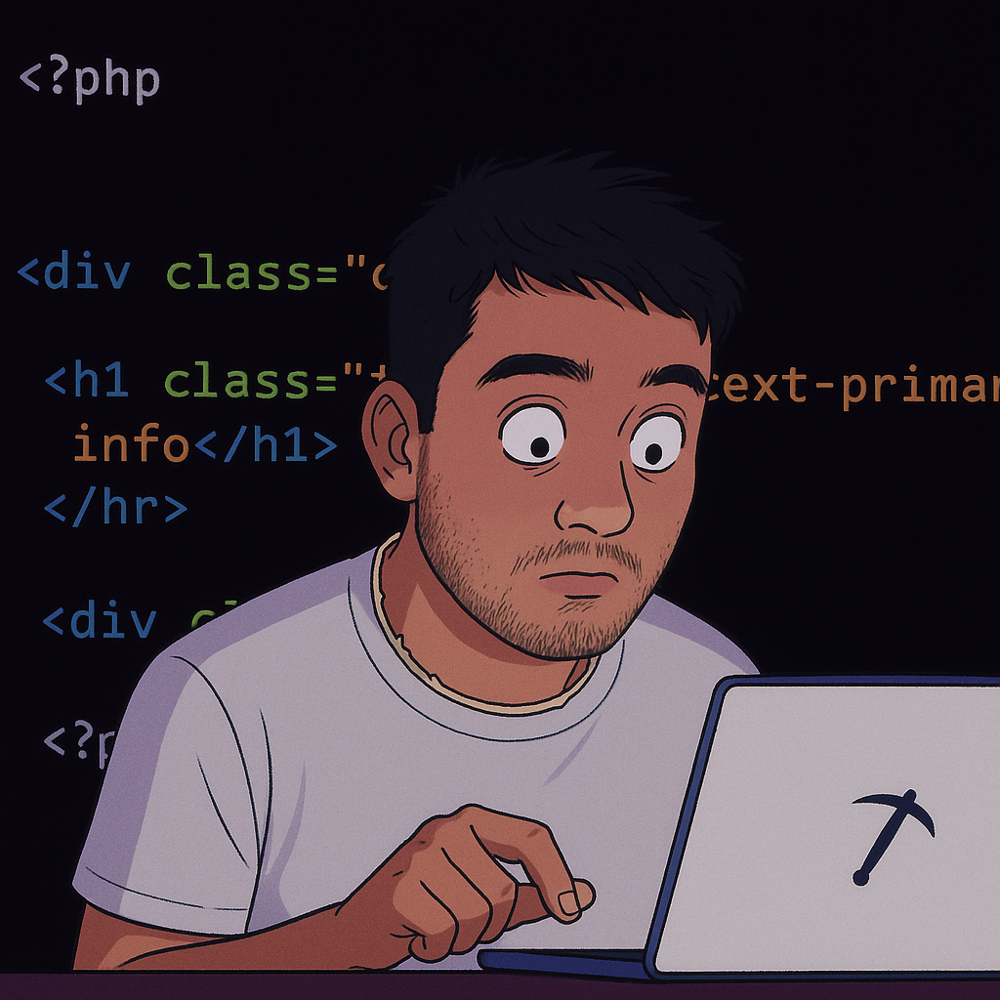

# 👋🏼 Hola a todos! Soy Lautaro  

## Soy **Frontend Developer** 
Con conocimientos en **React, JavaScript y TypeScript.**
Me apasiona crear interfaces limpias, funcionales y con una experiencia de usuario intuitiva.  
Disfruto cuidar los detalles visuales y de usabilidad, asegurando que cada proyecto sea accesible, responsive y fácil de utilizar, sin perder de vista las buenas prácticas de desarrollo.
  
## 🌟 Además de lo técnico, valoro y disfruto mucho el trabajo en equipo.  
Me destaco por mis habilidades de comunicación, adaptabilidad y resolución de problemas,  
lo que me permite aprender rápido y aportar en entornos colaborativos.  
También me gusta ayudar y compartir mis conocimientos cuando la situación lo requiere.

## 

## 🤖 Además, me interesa mucho la **Inteligencia Artificial** y cómo funciona.  
Es un tema que me gustaría **profundizar a futuro**, una vez que me especialice por completo en el frontend,  
explorando cómo se crean modelos, cómo aprenden y cómo pueden aplicarse en proyectos reales.  
Siempre buscando aprender y aplicar nuevas tecnologías en proyectos reales.

   

📫 Puedes encontrarme en [LinkedIn](https://www.linkedin.com/in/lautaro-zaraterivas/). 
